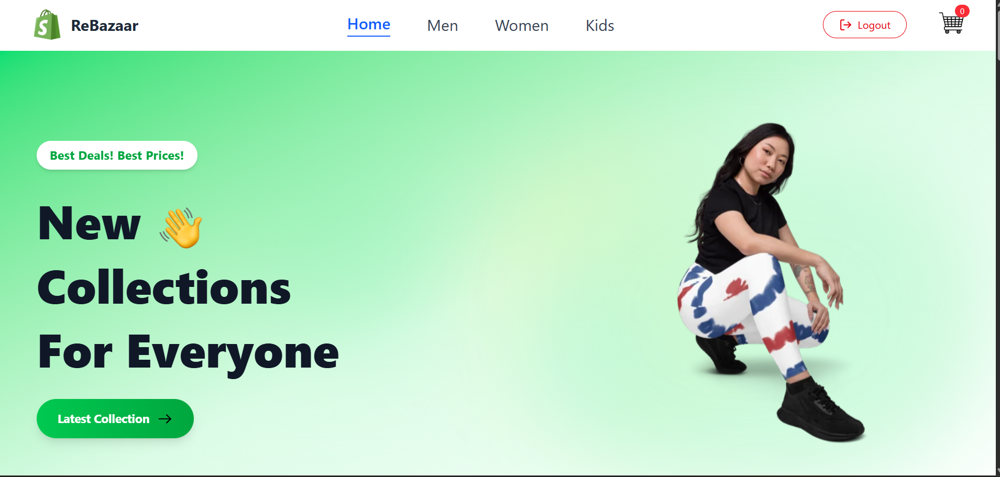
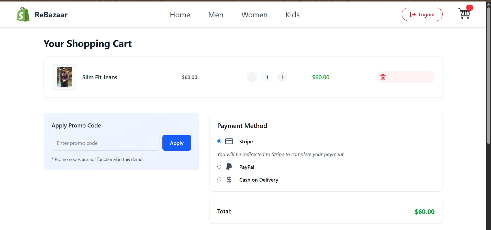

# 🛒 ReBazaar

**ReBazaar** is a full-stack e-commerce web application built using the MERN stack. It allows users to browse, search, and purchase products with a smooth shopping experience. Features include Stripe payment integration, user authentication, and an admin dashboard to manage the store.

---

## ✨ Features

- 🔐 User registration & login (with JWT auth)
- 🛍️ Browse and search products
- 🛒 Add to cart & checkout functionality
- 💳 Secure payments with **Stripe**
- 🧾 Order tracking
- 🛠️ Admin panel to manage inventory
- 📱 Mobile responsive UI

---

## 🖼️ Screenshots

| Home Page | Product Page | Cart age
|-----------|--------------|----------|
|  |  | 

---

## 🛠️ Tech Stack

**Frontend**
- React.js
- Tailwind CSS
- Axios
- React Router

**Backend**
- Node.js
- Express.js
- MongoDB + Mongoose
- JSON Web Token (JWT)
- Bcrypt.js
- **Stripe API** (for payments)

---

## 🚀 Getting Started

### 1. Clone the Repository

```bash
git clone https://github.com/guptaditya123/ReBazaar.git
cd ReBazaar
